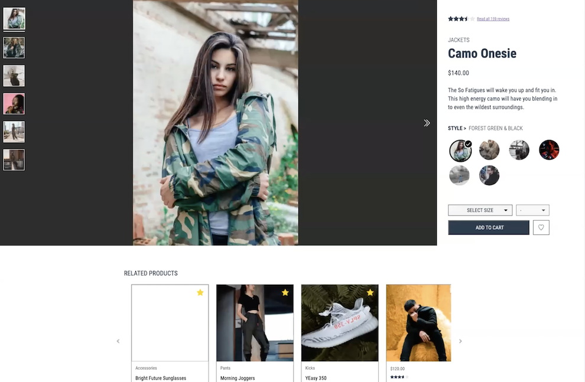
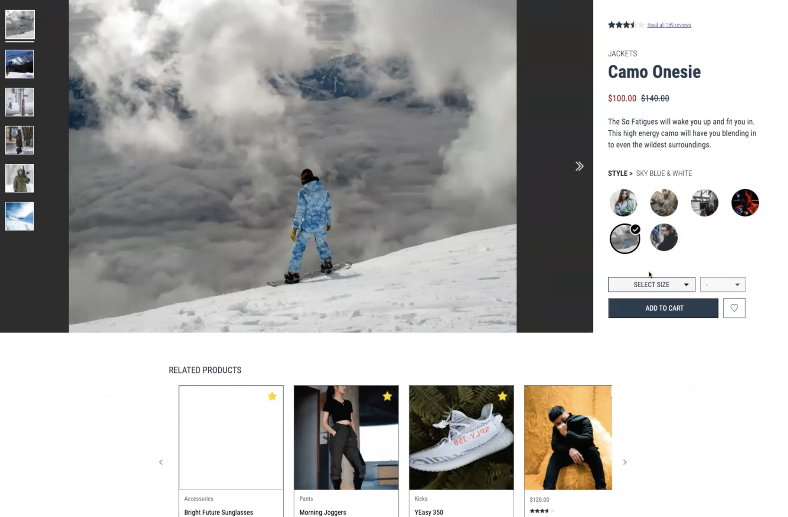
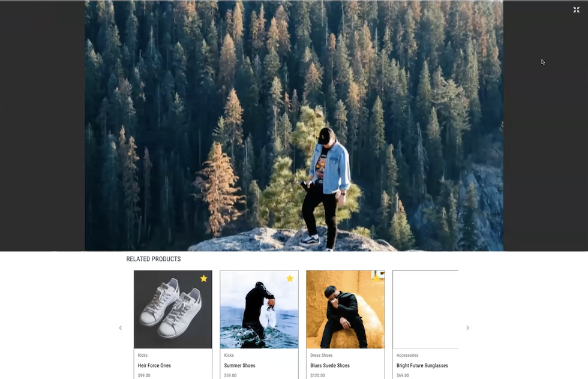
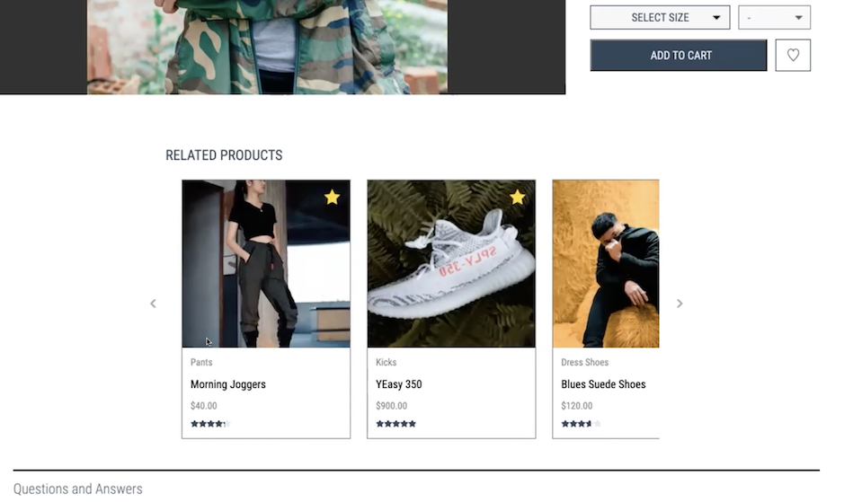
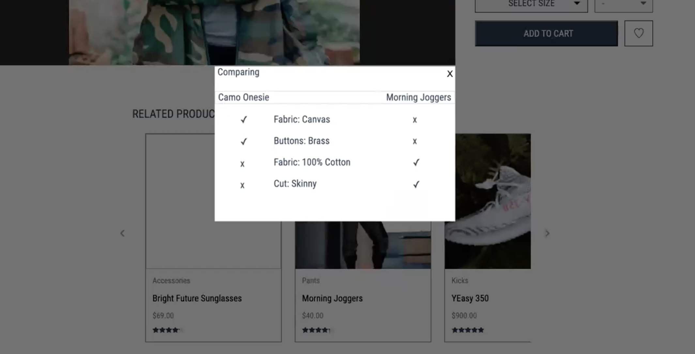
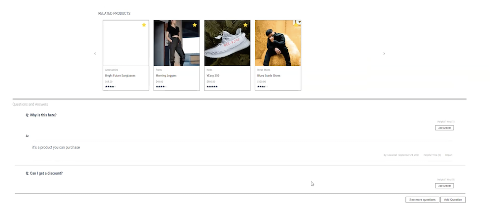
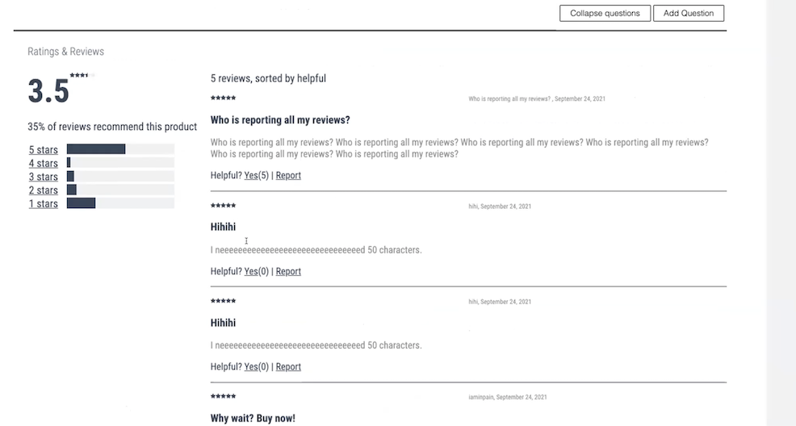
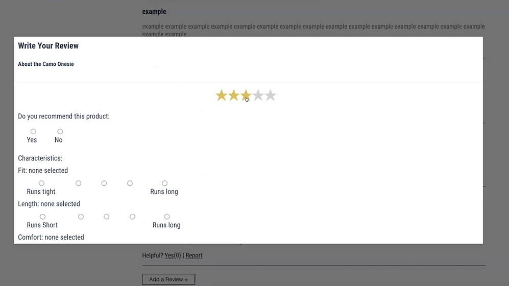

# Project Catwalk

### Contributors
<a href="https://github.com/afong888">Alan Fong</a>,
<a href="https://github.com/kyang9021">Kevin Yang</a>,
<a href="https://github.com/chiakat">Katherine Yu</a>,
<a href="https://github.com/r-jeng">Robin Jeng</a>

 

<!-- ABOUT THE PROJECT -->
## About The Project

  

This project was completed over a 2-week sprint in which our team built the front-end for a product page of an eCommerce site. The site features a product overview with an image gallery, style selector, and add-to-cart capabilities, related products, questions and answers, and ratings and reviews. The site was deployed on AWS then optimized for fast loading times to enable a seamless user experience.

(<a href="#top">back to top</a>)

## App Features

<table>
  <tr>
    <td>
      
    </td>
    <td>
      <b>Product Overview:</b>  The product overview includes an image gallery for the selected product, product description, price and ratings. The user can select from different styles, sizes and quantities to add to cart. Sale prices are shown in red next to the original.
    </td>
  </tr>
    <tr>
    <td>
      
    </td>
    <td>
      <b>Expanded View:</b>  When a user zooms into the image, the image gallery expands to the width of their screen to enable a closer look.
    </td>
  </tr>
  <tr>
    <td>
      
    </td>
    <td>
      <b>Related Products:</b>  Users can scroll through the related products carousel to see suggested products. Each related product card contains the name, image, price, and rating for the product.
    </td>
  </tr>
  <tr>
  <tr>
    <td>
      
    </td>
    <td>
      <b>Compare Products:</b>  A user can click on the card of a related product to compare its features with the current product. A modal popup allows a user to compare without leaving the page.
    </td>
  </tr>
  <tr>
    <td>
      
    </td>
    <td>
      <b>Questions and Answers:</b>  Questions and answers related to the product are shown in this section. Only 2 sets of questions and answers are shown by default, but users can click expand to see additional questions and answers. Users can post their own questions and answers. They can also mark specific questions and answers as helpful. Marking as helpful will move it toward the top of the list, allowing other users to locate helpful data more easily. Users can also report questions and answers to remove them from the list.
    </td>
  </tr>
  <tr>
    <td>
      
    </td>
    <td>
      <b>Ratings and Reviews:</b>  Users can see how other customers have rated the product from a scale of 1-5. An average of all scores is shown, as well as the breakdown by rating. The stars correspond with the average rating. Up to 4 reviews is shown by default but users can click to see more. Users can also add their own rating and reviews for the product. Like questions and answers, users can also mark reviews as helpful to increase visibility or report to remove them.
    </td>
  </tr>
    <tr>
    <td>
      
    </td>
    <td>
      <b>Write Reviews:</b>  A modal popup allows a user to add a review for the selected product without leaving the page.
    </td>
  </tr>
</table>

(<a href="#top">back to top</a>)

### Built With
* [React.js](https://reactjs.org/)
* [Redux.js](https://redux.js.org/)
* [Express.js](https://expressjs.com/)
* [React Testing Library](https://testing-library.com/)
* [CircleCi](https://circleci.com/)

(<a href="#top">back to top</a>)

## Getting Started
First install dependencies:
npm install

To create a development build:
npm run react-dev

To start server:
npm run start

Launch site:
http://localhost:3005

(<a href="#top">back to top</a>)
